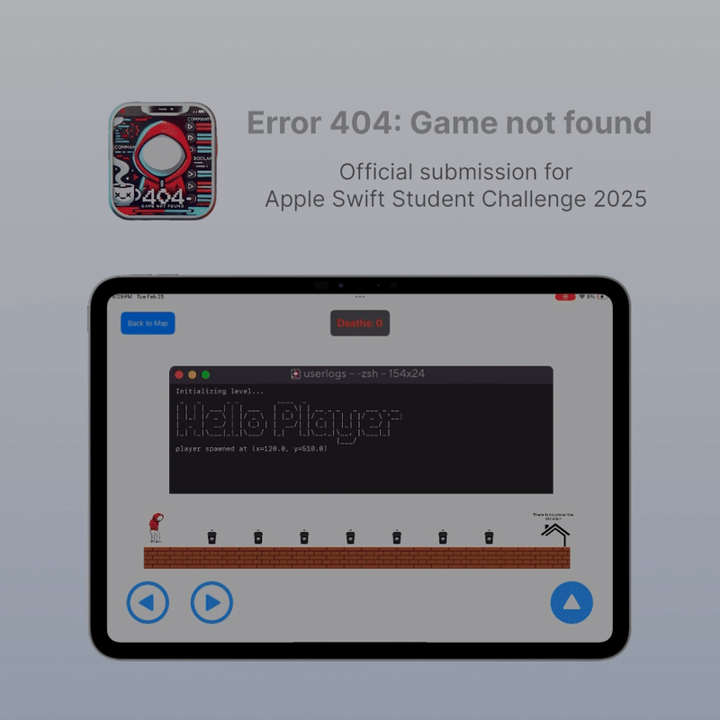

# Error 404: Game not found
Apple swift student challenge submission

By Dhruv Goswami

# Description
Error 404: Game not found is a fun troll game with meta humor that breaks the fourth wall.

The goal is to create a fun yet frustrating troll-platformer experience that constantly subverts player expectations. I wanted players to feel a mix of surprise, laughter, and mild rage, where the challenge comes from deceptive mechanics rather than traditional difficulty.

By using misleading obstacles, fake checkpoints, gravity shifts, and "helpful" items that actually kill the player, the game turns standard platformer logic upside down, making every step unpredictable. Despite its trolling nature, the game remains engaging by balancing frustration with humor, encouraging players to push forward even after countless deaths.

# Specs and Frameworks

- Swift and SpriteKit.
- Swift Playgrounds for level design
- Core ML for custom ML Insights
- Created in Swift Playgrounds 4.5

# DEMO
Below is the GIF, for full video click on the link: [FULL VIDEO](https://x.com/dhruv_10_/status/1894683009053290782?s=46&t=EmAIHW81LPGE4pjfh4TMTA)

